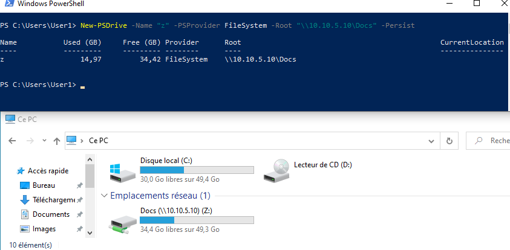

# Partage_de_fichiers

<ins>Pré-requis:</ins>
- Deux machines -> une cliente / une serveur
- Les deux machines peuvent faire un "ping" et se voir sur le réseau
- Mettre la machine client sur le Domaine AD.

## Sur le serveur
- 1: Installer le rôle ADDS sur le serveur et créer un domaine
-> Une fois installé, redémarrer la machine.
- 2: Créer un dossier *Documents_Entreprise* ainsi que les sous-dossiers (RH, Direction, Comptabilité) Au niveau du disque "c"
- 3: Ensuite, dans *serveuur manager* -> Cliquer sur *File and storage services* -> *Shares* -> *New shares* -> Choisir un *partage SMB - Rapide*. Sélectionner l'emplacement du dossier à partager -> *Nommer le partage* ("Docs", ici) -> Configurer les permissions (Les permissions seront attribuées à tout le monde dans un premier temps) et terminé. 
- 4: Créés des *OU* RH, Comptabilité, Direction.
- 5: Créés des *Utilisateurs* (Ex: User1, User2, USer3) et en mettre un dans chaque *OU*.
- 6: Créés des *Groupes* (Ex: Grp_RH, Grp_Comptabilité, Grp_Direction) et ajouter chaque utilisateur à un groupe.
A la fin nous aurons par exemple: *OU* RH avec un *User1* ajouté au groupe *Grp_RH*
- 7: Gère l'accès de ton dossier *Documents_Entreprise* et retirant l'héritage dans *Security* -> *Advanced* -> *Remove all inheritance ...* et donner l'accès à tous les utilisateurs du domaine en **Lecture seule**. Faire la même chose dans les sous-dossiers (RH, Direction, Comptabilité)
 > - Sous-dossier RH = Le groupe "RH" et "Direction" ait un accès en lecture/écriture au dossier "RH"
 > - Sous-dossier Direction = Le groupe "Direction" ait un accès en lecture/écriture à tous les dossiers
 > - Sous-dossier Comptabilité = Le groupe "Comptabilité" et "Direction" ait un accès en lecture/écriture au dossier "Comptabilité"
- 8: Pour lister tous les partages sur le serveur la commande est la suivante: `Get-SmbShare`

  

  ## Sur le client

- configure un lecteur réseau pointant vers ce partage via PowerShell
- 

-Enfin, vérifier que les utilisateurs ont bien accès au dossier *Docs*, avec chacun leur restriction
  

